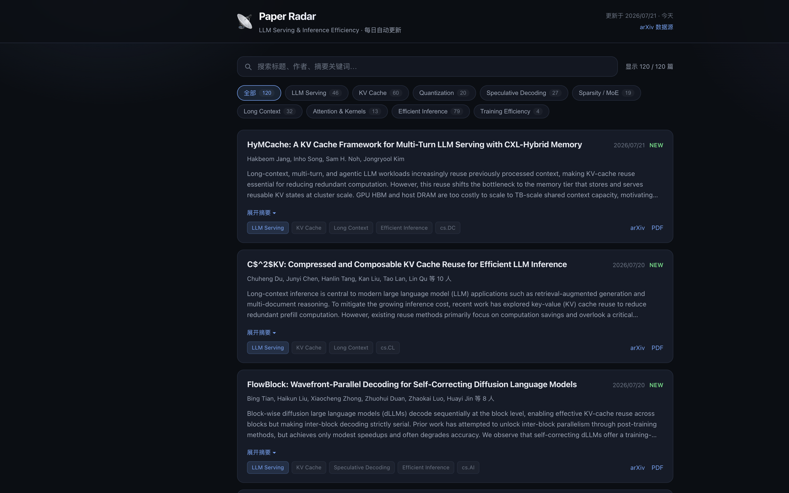

# 📡 Paper Radar — LLM Serving & Inference Efficiency

一个**每天自动更新**的论文追踪网页，聚焦 **LLM 推理服务 / 高效化（efficiency）** 方向的最新工作。数据来自 [arXiv](https://arxiv.org)，前端是纯静态页面，可直接托管到 GitHub Pages。



## 特性

- **自动抓取**：从 arXiv 官方 API 拉取最近 45 天内的相关论文。
- **智能分类**：按主题自动打标签（LLM Serving / KV Cache / Quantization / Speculative Decoding / MoE / Long Context / Attention & Kernels / Efficient Inference 等）。
- **中文翻译**：抓取时自动把标题、摘要译成中文（前端默认中文，保留英文原文），无需 API key。
- **质量评估**：基于 arXiv 元数据启发式打分（0–100，A/B/C/D 分级），综合会议录用、开源代码、加速/SOTA 结论、知名基准、模型规模、团队规模等信号；卡片显示星级徽章（悬停看评分理由），支持按质量排序。
- **现代化 UI**：暗色主题、主题筛选、实时关键词搜索、可展开摘要、arXiv/PDF 直链、NEW 标记。
- **零依赖**：抓取脚本只用 Python 标准库；前端无框架、纯 HTML/CSS/JS。
- **每日自动更新**：GitHub Actions 定时任务每天抓取一次并部署到 GitHub Pages。

## 目录结构

```
paper-radar/
├── index.html              # 前端页面
├── assets/
│   ├── style.css           # 样式
│   └── app.js              # 交互逻辑（加载 data/papers.json）
├── fetch_papers.py         # 抓取 + 分类脚本（生成 data/papers.json）
├── data/
│   └── papers.json         # 生成的论文数据（前端消费）
├── .github/workflows/
│   └── update.yml          # 每日自动更新 + 部署
└── requirements.txt
```

## 本地运行

```bash
# 1. 抓取最新论文（约需 40s，会礼貌地限速请求 arXiv）
python3 fetch_papers.py

# 2. 启动本地静态服务器预览
python3 -m http.server 8777

# 3. 浏览器打开
open http://localhost:8777
```

> 直接双击 `index.html` 也能打开，但浏览器的 `file://` 协议会阻止 `fetch` 读取本地 JSON，所以建议用上面的本地服务器方式预览。

## 部署到 GitHub Pages（每日自动更新）

1. 新建一个 GitHub 仓库，把本目录内容推上去：

   ```bash
   cd paper-radar
   git init && git add . && git commit -m "init: paper radar"
   git branch -M main
   git remote add origin https://github.com/<你的用户名>/<仓库名>.git
   git push -u origin main
   ```

2. 在仓库 **Settings → Pages → Build and deployment → Source** 选择 **GitHub Actions**。

3. 完成。`.github/workflows/update.yml` 会：
   - 每天 **01:00 UTC（北京时间 09:00）** 自动运行 `fetch_papers.py`；
   - 把更新后的 `data/papers.json` 提交回仓库；
   - 重新部署页面到 GitHub Pages。

   你也可以在 **Actions** 页面手动点击 **Run workflow** 立即触发一次。

## 自定义

编辑 `fetch_papers.py` 顶部的配置：

| 变量 | 作用 |
| --- | --- |
| `SEARCH_TERMS` | arXiv 搜索关键词列表（标题/摘要匹配） |
| `TOPIC_KEYWORDS` | 主题标签及其匹配的正则关键词（决定分类与筛选按钮） |
| `CATEGORIES` | 限定的 arXiv 分类（如 `cs.DC`, `cs.LG`, `cs.CL`…） |
| `MAX_AGE_DAYS` | 只保留最近多少天的论文（默认 45） |
| `MAX_PAPERS` | 最终展示的论文上限（默认 120） |

> 想追踪别的方向？只要改这两个字典，前端筛选按钮会自动跟着变化，无需改动前端代码。

## 数据来源与礼仪

- 数据来自 arXiv API（`export.arxiv.org/api/query`）。
- 脚本在每次查询之间 `sleep(3)` 以遵守 arXiv 的使用礼仪，请勿把频率调得过高。
